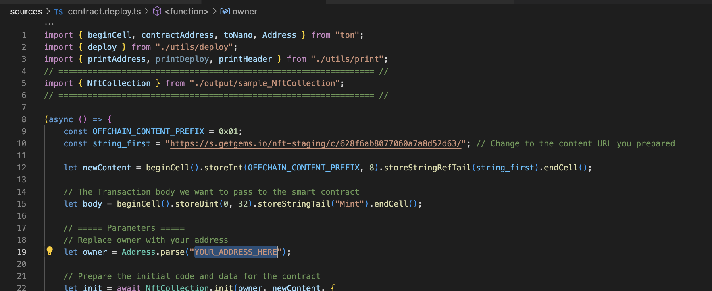

# NFT Standard in Tact

1.yarn install 包下不全

2.删除package-lock.json 后 执行yarn install

3. 执行 nftminter.ts process.env.MNEMONICS 获取的密钥文件不知道在哪里 路径位置？


控制一个用户只能 mint 身份一次。


核心：父子合约
  子合约地址由，父合约和用户wallet地址算出
  子合约存储：parent 和 用户wallet地址

logan实现：子合约存储是否初始化，第一次初始化时，将mint信息传递给conllection
luke实现：
   在collection合约中，请求子合约，子合约若失败利用 bounced 创建子合约并 mint身份
   因为bounced 无法获取最初sender(),需要使用map提前存储 


<a href="https://star-history.com/#Ton-Dynasty/tondynasty-contracts&Date">

  <picture>
    <source media="(prefers-color-scheme: dark)" srcset="https://api.star-history.com/svg?repos=howardpen9/nft-template-in-tact&type=Date&theme=dark" />
    <source media="(prefers-color-scheme: light)" srcset="https://api.star-history.com/svg?repos=howardpen9/nft-template-in-tact&type=Date" />
    
  </picture>
</a>

This GitHub repository is dedicated to an NFT standard ([TEP-62](https://github.com/ton-blockchain/TEPs/blob/master/text/0062-nft-standard.md)), which provides a set of guidelines and specifications for creating and managing non-fungible tokens (NFTs) on blockchain platforms.

> The repository contains a comprehensive collection of code files, documentation, and resources that developers can utilize to implement the standard in their NFT projects. It offers a well-defined structure and functionality for NFT contracts, including features like token metadata, ownership transfers, and token enumeration.
>
> The repository also includes sample code and examples to help developers understand and implement the NFT standard more easily. Collaborators and contributors actively maintain and update the repository, ensuring it remains up-to-date with the latest advancements and best practices in the NFT ecosystem.

-   https://github.com/ton-blockchain/TEPs/blob/master/text/0062-nft-standard.md
-   https://github.com/ton-blockchain/TEPs/blob/master/text/0064-token-data-standard.md
-   https://github.com/ton-blockchain/TEPs/blob/master/text/0066-nft-royalty-standard.md

## How to use

```bash
yarn build # To build contract
yarn test # To run test cases
yarn deploy # To deploy contract
yarn read # The way to read the smart contract data after your deployed the code
```

> [!WARNING]
> Remember to change the parameter in `contract.deploy.ts` file before you run `yarn deploy`



---

 - once you run `yarn deploy` you will get the address of the deployed contract. You can use this address to interact with the contract.

## More

For more information about this GitHub repository, or if you have any questions related to Tact, feel free to visit:

-   https://t.me/ton101
-   https://t.me/tactlang

If you have more specific questions related to the Tact Language, please refer to:

-   https://tact-lang.org
-   https://tact-by-example.org
